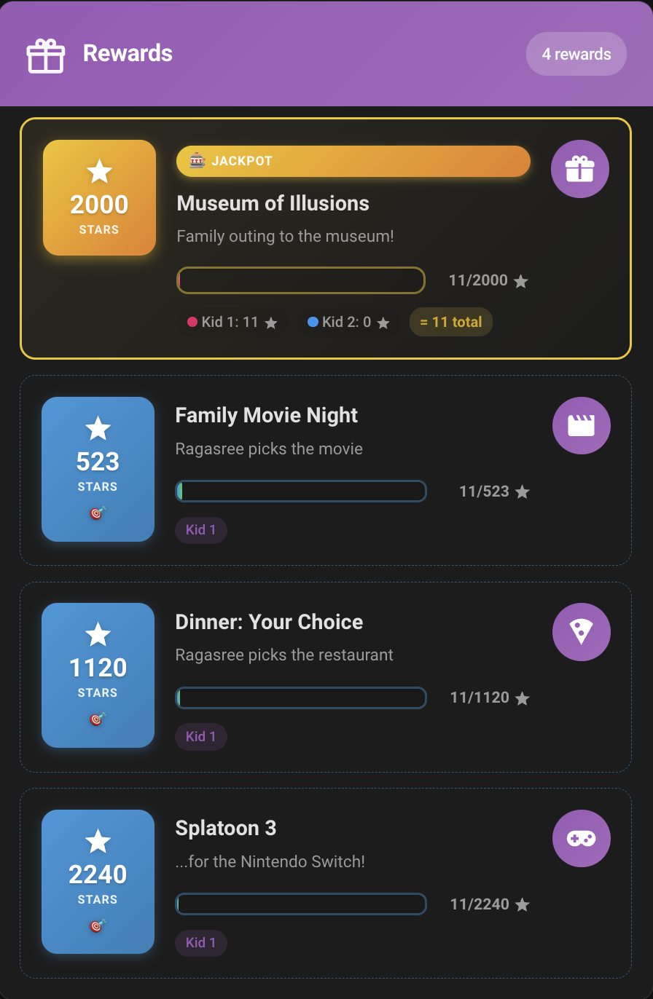
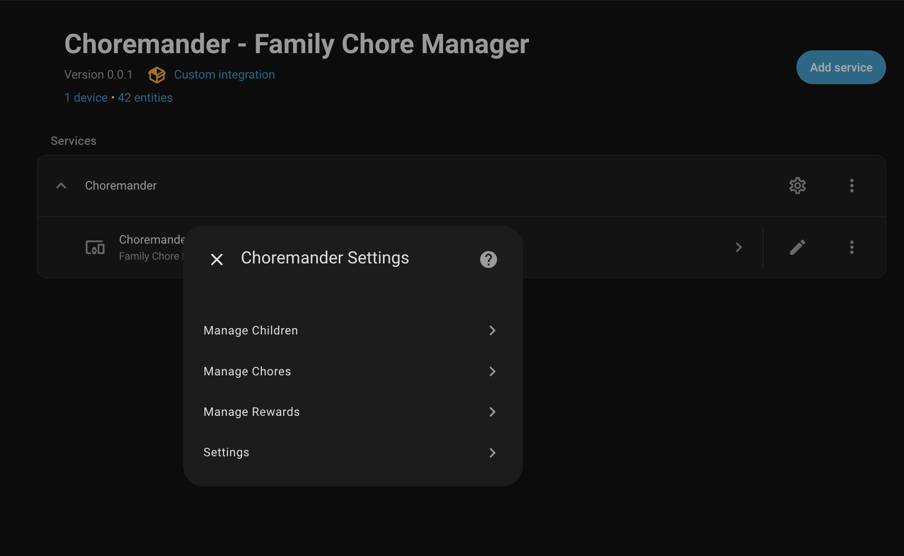
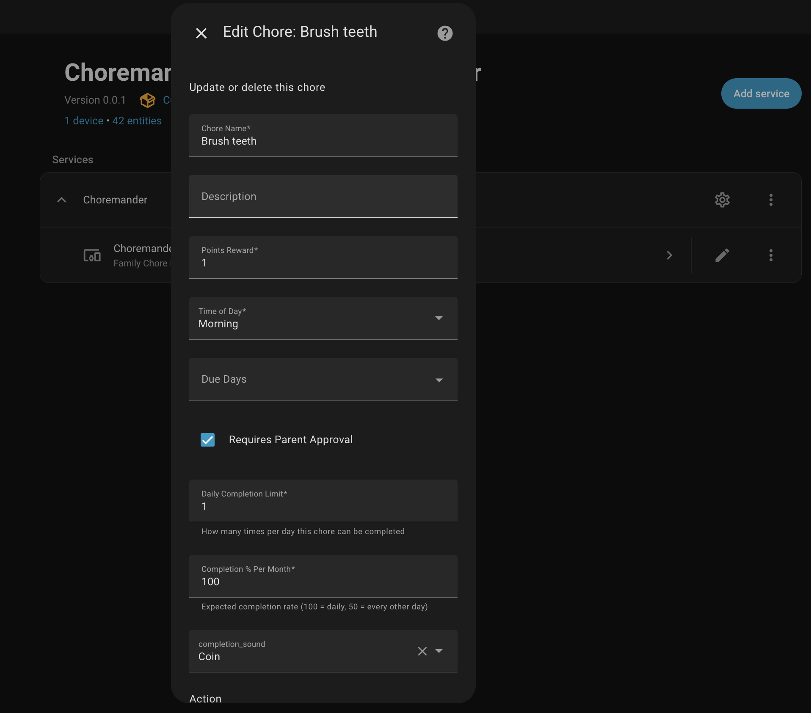
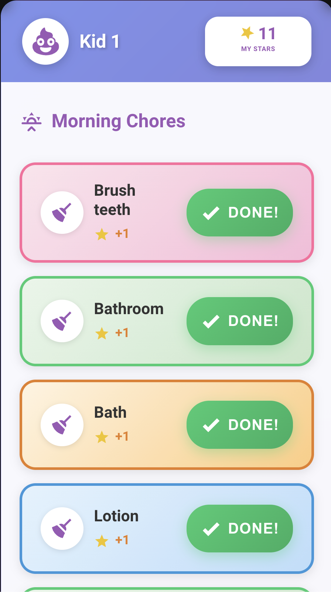
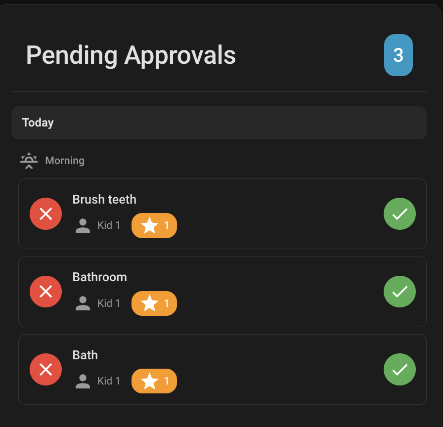

<p align="center">
  
</p>

<h1 align="center">Choremander</h1>
<p align="center">
  <strong>Turn chores into a game your kids actually want to play.</strong><br>
  A Home Assistant integration for family chore management with smart rewards.
</p>

---

## Contents

- [Why Choremander?](#why-choremander)
- [Quick Start](#quick-start)
- [Features](#features)
- [Dashboard Cards](#dashboard-cards)
- [Smart Reward Pricing](#smart-reward-pricing)
- [Tips](#tips)
- [Development](#development)

---

## Why Choremander?

Kids don't naturally love chores. But they *do* love games, progress bars, and earning things. Choremander turns daily responsibilities into a reward system that actually motivates.

### Build Better Habits Through Gamification

- **Visual progress** toward goals keeps kids engaged
- **Immediate feedback** (points, sounds, celebrations) reinforces positive behavior
- **Clear expectations** - kids know exactly what's required and what they'll earn

### Encourage the Right Behaviors

Not all chores are equal. Some are easy (brush teeth), others take effort (homework, practice). With Choremander:

- **Weight points by difficulty** - Give 1 star for easy tasks, 5 stars for harder ones
- **Harder chores = faster rewards** - Kids learn that putting in effort pays off
- **No gaming the system** - Smart pricing means you can't just spam easy chores to win

### Flexible Rewards That Make Sense

- **Per-child or shared** - Define rewards for one kid or assign to multiple
- **Smart pricing per child** - Even shared rewards calculate costs individually based on each child's chores and completion rates
- **Control the pace** - Set how many days a reward should take to earn; the system calculates the rest
- **Jackpot rewards** - Pool stars from all kids toward big family goals (vacation, museum trip, etc.)

<p align="center">
  
</p>

---

## Quick Start

### Install via HACS

1. **HACS** → Integrations → ⋮ menu → **Custom repositories**
2. Add `https://github.com/vinnybad/choremander` as an **Integration**
3. Search "Choremander" and install
4. **Restart Home Assistant**

### Configure

1. **Settings** → Devices & Services → **Add Integration** → "Choremander"
2. Choose your points currency (Stars, Coins, Bucks, etc.)
3. Click **Configure** on the integration to manage everything:

<p align="center">
  
</p>

---

## Features

### Chores

<p align="center">
  
</p>

| Feature | Description |
|---------|-------------|
| **Points** | Stars earned for completion |
| **Time of Day** | Morning, Afternoon, Evening, Night, or Anytime |
| **Completion % Per Month** | Expected completion rate (100 = daily, 50 = every other day) - used for smart reward pricing |
| **Daily Limit** | How many times per day the chore can be completed |
| **Requires Approval** | Parent must approve before points are awarded |

### Rewards

| Type | Description |
|------|-------------|
| **Dynamic** *(default)* | Cost auto-calculated: `Days to Goal` × expected daily earnings (based on each chore's points and completion rate) |
| **Fixed** | Toggle "Override Point Value" to set a manual cost |
| **Jackpot** | Pool stars from ALL assigned children toward one big family reward |

---

## Dashboard Cards

Cards auto-register when the integration loads. Just add them to your Lovelace dashboard - no manual resource configuration needed!

### Adding Cards (Visual Editor)

The easiest way to add Choremander cards:

1. Edit your dashboard and click **Add Card**
2. Search for the card (e.g., "choremander-child-card") or scroll to find it under "Custom"
3. Alternatively, add a **Manual** card and enter the card type (e.g., `custom:choremander-child-card`)
4. The card will show a configuration interface - enter `sensor.choremander_overview` in the entity field
5. Fill in any additional options (child selection, time of day, etc.) and save

> **Tip:** If the card shows an error after adding, click on it to open the configuration panel. This is normal - it just needs to be configured!

### YAML Mode Users

If you use Lovelace in YAML mode, add these resources to your `configuration.yaml`:

```yaml
lovelace:
  resources:
    - url: /choremander/choremander-child-card.js
      type: module
    - url: /choremander/choremander-rewards-card.js
      type: module
    - url: /choremander/choremander-approvals-card.js
      type: module
    - url: /choremander/choremander-points-card.js
      type: module
    - url: /choremander/choremander-reorder-card.js
      type: module
```

### Card Index

| Card | For | Description |
|------|-----|-------------|
| [Child Card](#child-card) | Kids | Kid-friendly chore completion interface |
| [Rewards Card](#rewards-card) | Kids | View available rewards and progress |
| [Approvals Card](#approvals-card) | Parents | Approve or reject completed chores |
| [Points Card](#points-card) | Parents | Manually add/remove points |
| [Reorder Card](#reorder-card) | Parents | Organize chore display order per child |

> **Tip:** Create separate dashboards - one for kids (Child + Rewards) and one for parents (Approvals + Points).

---

### Cards for Kids

#### Child Card

Kid-friendly interface with big colorful buttons and celebration sounds. This is the primary way children interact with their chores.

<p align="center">
  
</p>

**Visual Editor:** Add `custom:choremander-child-card`, then configure the entity (`sensor.choremander_overview`), select a child, and optionally filter by time of day.

<details>
<summary>YAML Example</summary>

```yaml
type: custom:choremander-child-card
entity: sensor.choremander_overview
child_id: a8c8376a
time_category: morning  # Optional: morning, afternoon, evening, night, anytime
title: My Chores        # Optional
```
</details>

#### Rewards Card

Shows all available rewards with progress bars. Displays dynamic pricing indicators and jackpot status.

**Visual Editor:** Add `custom:choremander-rewards-card`, configure the entity, and optionally filter to a specific child.

<details>
<summary>YAML Example</summary>

```yaml
type: custom:choremander-rewards-card
entity: sensor.choremander_overview
child_id: 6ddfca70  # Optional: filter to specific child
```
</details>

---

### Cards for Parents

#### Approvals Card

Review and approve (or reject) completed chores that require parent approval. Shows pending items grouped by time of day.

<p align="center">
  
</p>

**Visual Editor:** Add `custom:choremander-approvals-card` and configure the entity.

<details>
<summary>YAML Example</summary>

```yaml
type: custom:choremander-approvals-card
entity: sensor.choremander_overview
```
</details>

#### Points Card

Manually add bonus points (great job today!) or remove points (consequences). Useful for situations outside the normal chore flow.

**Visual Editor:** Add `custom:choremander-points-card` and configure the entity.

<details>
<summary>YAML Example</summary>

```yaml
type: custom:choremander-points-card
entity: sensor.choremander_overview
```
</details>

#### Reorder Card

Drag-and-drop interface to organize the order chores appear for each child. Customize the experience per kid.

**Visual Editor:** Add `custom:choremander-reorder-card`, configure the entity, and select a child.

<details>
<summary>YAML Example</summary>

```yaml
type: custom:choremander-reorder-card
entity: sensor.choremander_overview
child_id: a8c8376a
```
</details>

---

> **Note:** All cards require the `sensor.choremander_overview` entity. Child-specific cards also need a child selection.

---

## Smart Reward Pricing

The goal: **every reward should take a predictable amount of time to earn** - not random guessing.

### The Problem with Fixed Prices

If you set "Family Movie Night" to cost 500 stars, how long does that take? A week? A month? You'd have to manually calculate based on all assigned chores... and recalculate every time you add or change one.

### How Smart Pricing Works

You set **Days to Goal** (e.g., 14 days). Choremander does the math:

1. Looks at each chore's **point value** and **expected completion rate**
2. Calculates how many points the child *should* earn per day
3. Sets the reward cost so it takes exactly that many days

```
Daily Expected Points = Sum of (Chore Points × Completion %)
Reward Cost = Daily Expected Points × Days to Goal
```

### Why This Encourages Better Behavior

Here's the key insight: **completion rate matters**.

If a child only does "Homework" 60% of the time but "Brush teeth" 100% of the time, the pricing reflects that. Kids who consistently do the *harder* chores will hit their goals faster than kids who only do the easy ones.

**The incentive:** Want that reward sooner? Do the challenging stuff, not just the minimum.

| Behavior | Result |
|----------|--------|
| Only does easy daily chores | Earns rewards at the expected pace |
| Tackles harder/optional chores | Earns rewards *faster* than expected |
| Skips difficult chores | Falls behind the expected pace |

### Jackpot Rewards

For big family goals (vacation, museum trip), enable **Jackpot** mode. All children's stars pool together toward one shared reward - teamwork!

---

## Tips

- **Two dashboards:** One for kids (Child + Rewards), one for parents (Approvals + Points)
- **Completion %:** Set lower for optional/weekly chores so they don't inflate reward costs
- **All data is local:** Nothing leaves your Home Assistant instance

---

## Development

### Testing Changes Locally

A Docker-based dev environment is included for testing changes without touching your real Home Assistant instance.

#### Requirements
- Docker and Docker Compose

#### Quick Start

```bash
# Start the dev environment (first run will download HACS)
./dev/start.sh

# Open browser to http://localhost:8123
# Login: dev / dev
# Three test dashboards are pre-configured in the sidebar:
#   - Kid A (morning/evening chores, progress, rewards)
#   - Kid B (morning/evening chores, progress, rewards)
#   - Parent (approvals, points management, reorder)
```

#### Development Workflow

```bash
# Make changes to Python files in custom_components/choremander/
# Then restart to see changes:
./dev/restart.sh

# Make changes to JS card files - just hard refresh browser (Cmd+Shift+R)

# View filtered logs while testing
./dev/logs.sh

# Get a shell inside the container
./dev/shell.sh

# Stop when done
./dev/stop.sh

# Reset to fresh state (removes auth, HACS, database)
./dev/reset.sh
```

#### Pre-configured Test Data

The dev environment comes with:
- **2 kids:** Krishna (25 stars) and Radha (15 stars)
- **8 chores:**
  - Shared: Make Bed, Brush Teeth (AM/PM), Tidy Room
  - Krishna only: Feed the Dog, Do Homework
  - Radha only: Water the Plants, Practice Piano
- **5 rewards:**
  - 30 Min Screen Time (dynamic pricing, 7 days) - shared
  - New Video Game (50 stars, fixed) - Krishna only
  - New Book (30 stars, fixed) - Radha only
  - Family Movie Night (jackpot, 14 days) - shared
  - Trip to the Zoo (jackpot, 30 days) - shared

---

<p align="center">
  <sub>License: MIT</sub>
</p>
